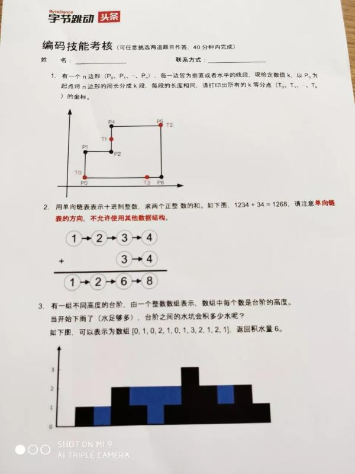

> 装逼的先说在前头，我个人还不喜欢“预习”或记一些面试题的。相比于这些，我更注重 **平时的积累**。哪怕去面试了，也不会去看面试题。结果也往往很惨。哈哈哈。
> 昨天吧，我常聊的一个技术交流群发了一个面试题的图片，乍看一下，还有点意思。emmmm，然后就解题了。 
> 所以以后，有意思的面试题，还是可以拿出来分享和以及说说解题过程。

<!-- more -->

先上图（侵删）。图上已经写了是头条的。题目感觉还是不错的，难度还行，但可以作为一定的门槛了。相比于那些面试api的面试题，emmm，不说了，这个贼恶心，我被这个恶心到不少。


下面就直接开始解题吧。


## 1
> 这一题感觉就是纯编程题了，说不上啥算法题。无非就是计算一下这个n边形所有节点之间的距离。
  直接上代码吧。


```java
public class Demo {

    public static void main(String[] args) {
        List<Point> points = new ArrayList<>();
        points.add(new Point(2,2));
        points.add(new Point(2,4));
        points.add(new Point(6,4));
        points.add(new Point(6, 8));
        points.add(new Point(10,8));
        points.add(new Point(10, 2));

        List<Point> calc = new Square(points).calc(4);
        System.out.println(Arrays.toString(calc.toArray()));
    }

    static class Square {

        private List<Distance> distances = new ArrayList<>(); //边长
        private int perimeter; //周长

        public Square(List<Point> points) {
	    //初始化边长信息
            int perimeter = 0;
            Point first = points.get(0);
            for (int i = 0; i< points.size(); i++) {
                Point current = points.get(i);
                Point next = (i == points.size() -1) ? first : points.get(i + 1);

                boolean direction = current.x != next.x; //方向
                int length = Math.abs(direction ? next.x - current.x : next.y - current.y);
                perimeter += length;

                distances.add(new Distance(current, next, direction, length));
            }
            this.perimeter = perimeter;
        }


        public List<Point> calc(int k) {

            List<Point> result = new ArrayList<>();

            int segmentNum = perimeter / k;  //有多少段

            int stepLen = 0; //步长

            for (int i = 0; i < k; i++) {
                stepLen += segmentNum;

                int len = 0; //边长累加值
                for (Distance distance : distances) {
                    len += distance.length; //边长累加

                    if (len >= stepLen) {  //边长累加大于步长，节点有了
                        int a = len - stepLen;  //end节点减去多余的a，就是我们要找的那个节点。
                        Point end = distance.end;
                        int x = end.x, y = end.y;
                        if (distance.direction) { //水平
                            x = (distance.end.x > distance.start.x) ? end.x - a : end.x + a; //这里判断一下start，end坐标的横坐标在前在后的
                        } else {
                            y = (distance.end.y > distance.start.y) ? end.y - a : end.y + a; //如横坐标一下。
                        }
                        result.add(new Point(x, y));
                        break;
                    }
                }
            }
            return result;
        }
    }

    //两点之间的距离
    static class Distance {
        public Point start; //开始节点
        public Point end;   //结束节点
        public boolean direction; //true: 水平  false: 垂直方向
        public int length; //两点之间的长度
        public Distance(Point start, Point end, boolean direction, int length) {
            this.start = start;
            this.end = end;
            this.direction = direction;
            this.length = length;
        }
    }

    static class Point {
        public int x;
        public int y;
        public Point(int x, int y) {
            this.x = x;
            this.y = y;
        }
        @Override
        public String toString() {
            return "Point{x=" + x + ", y=" + y + '}';
        }
    }
}
```


## 2. 
 像这题，拍屁股都知道出题人想考的是反转链表。
1. 如果是反转双向链表的话，很简单，只需要改一下彼此的next,prev就行了。
2. 如果反转的是单向链表，就稍微麻烦一点。每个节点只记录了下一个节点的引用。不过通常有两种方式。
   * 第一种是借助栈（Stack）这种数据结构，先进后出。很适合这种反转单向链表。
   * 还有一种方式。不解释了，直接上代码吧。代码说明一切。


```java

   public static void main(String[] args) {
        //初始化数据
        Node n1 = new Node(1);
        Node n2 = new Node(2);
        Node n3 = new Node(3);
        Node n4 = new Node(4);
        n1.next = n2;
        n2.next = n3;
        n3.next = n4;

        Node nn3 = new Node(3);
        Node nn4 = new Node(4);
        nn3.next = nn4;
    	//初始end        

        System.out.println(sum(n1, nn3));
    }

   public static int sum(Node n0, Node n1) {
        n0 = flip(n0);
        n1 = flip(n1);
        int ratio = 1;
        int sum = 0;
        while (n0 != null || n1 != null) {
            int sum1 = ratio * (n0  == null? 0: n0.num);
            int sum2 = ratio * (n1  == null? 0: n1.num);
            sum += sum1 + sum2;
            n0 = n0  == null? null: n0.next;
            n1 = n1  == null? null: n1.next;
            ratio *= 10;
        }
        return sum;
    }
    
   
    //重点在这里
    public static Node flip(Node current) {

        Node prev = null; //用于当前节点处理完之后，就做为前一个节点了。
        while (true) {
            Node next = current.next;  //当前节点的next
            current.next = prev;       //把节点指向前一个节点
            prev = current;            //把当前节点做为前一个节点，下一个节点指向前一个节点的时候需要使用。
            current = next;            //把当前节点往后移
            if(next == null) return prev; 
        }
    }

    static class Node  {
        public int num;
        public Node next;
        public Node(int num) {
            this.num = num;
        }
    }

```

> 这里说个题外话，大家一定要动手去写一下，以前我也觉得反转单向链表贼简单，就没有动手写过。这次是第一次写，但是一开始有点生疏不知所措的感觉。所以多花了些时间。


### 粗暴野蛮
> 其实大家没必须被反转链表给迷惑了，这题题意是考大家反转链表。但是没有一定要求要这么干啊。
  所以咱简单粗暴一点，遍一次链表，看一下最大有多少10进制。然后再做计算。


```java

   public static void main(String[] args) {
        //初始化数据，不用理
        Node n1 = new Node(1);
        Node n2 = new Node(2);
        Node n3 = new Node(3);
        Node n4 = new Node(4);
        n1.next = n2;
        n2.next = n3;
        n3.next = n4;

        Node nn3 = new Node(3);
        Node nn4 = new Node(4);
        nn3.next = nn4;
        //初始end

        System.out.println(sum(n1, nn3));
    }

    public static int sum1(Node n0, Node n1) {
        int rate = 1;
        Node dump0 = n0 != null ? n0.next : null;
        Node dump1 = n1 != null ? n1.next : null;

        while (dump0 != null || dump1 != null) {
            rate *= 10;
            if(dump0 != null) dump0 = dump0.next;
            if (dump1 != null) dump1 = dump1.next;
        }

        int sum = 0;
        while (n0 != null || n1 != null) {
            if(n0 != null) {
                sum += (rate * n0.num);
                n0 = n0.next;
            }
            if(n1 != null) {
                sum += (rate * n1.num);
                n1 = n1.next;
            }
            rate /= 10;
        }
        return sum;
    }

```

是不是第二种简单一点呢，我觉得是。
如果面试时间紧张的话，可以考虑用第二种，然后后面面试的时候解释如何反转单向链表等等。


## 3
第三题还是挺有难度的，我思考了一下没啥思路。后面跟同事讨论一下，他提供了一种非常好的思路: 只算最下层的装水量。
简单来说: 只算最底层能装多少水，算完移除，上一层又移到最底层，以此类推直到算完。
手动上代码吧～

> 我再网上看了下其他人提供的思路，总的来说，还是这个思路简单。下面直接上代码吧。


```java
    public static void main1(String[] args) {
        int[] nums = new int[]{0, 1, 0, 2, 1, 0, 1, 3, 2, 1, 2, 1};
        int sum = 0;
        while (true) {
            boolean ifBreak = true;
            int leftIdx = 0; //左下标索引，必须又左下标索引才能装水。
            for(int i = 0; i < nums.length; i++) {
                if(nums[i] > 0) {
                    if(leftIdx != 0) {  //有左下标索引，能装水
                        sum += i - leftIdx - 1;
                    }
                    leftIdx = i; //装完之后，更新左下标索引。
                    nums[i] -=1; //往下移一层。
                    if(nums[i] > 0) ifBreak = false; //移完之后，发现这层这个index还有，不能break
                }
            }
            if(ifBreak) break; //没有层了。
        }
        System.out.println(sum);
    }
 
```


## 总结
 1. 题目看起来很简单，但是建议还是动手写一下。特别是手动反转单向链表基本是面试题的常客。
 2. 有些题目看似应该这么解，其实还有很多解法。所以这些题目可以很发散思路的。从这个维度来说这个面试题是很不错的。
 3. 与人讨论和沟通还是不错的，与其自己冥思苦想也找不到答案时，不妨跟你的同事沟通一下，多人多思路。


---  
### 所以就这样咯，晚安。


