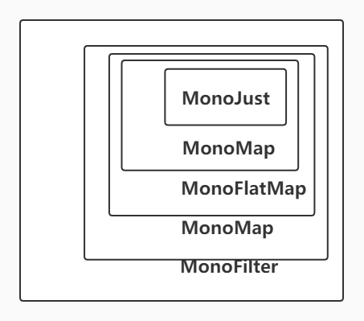
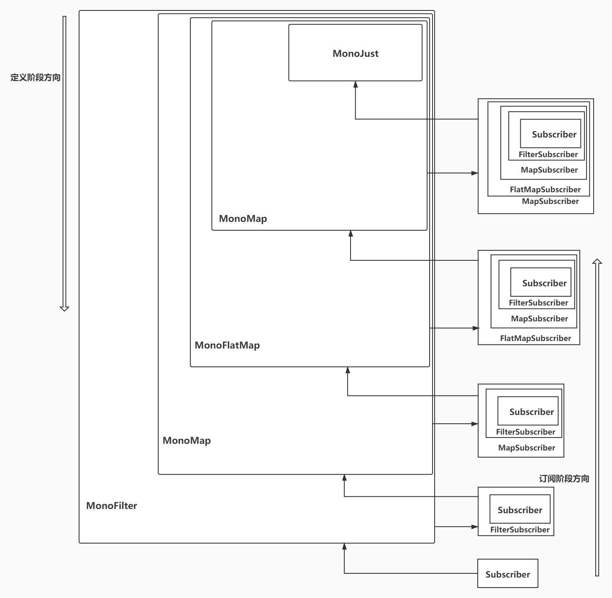
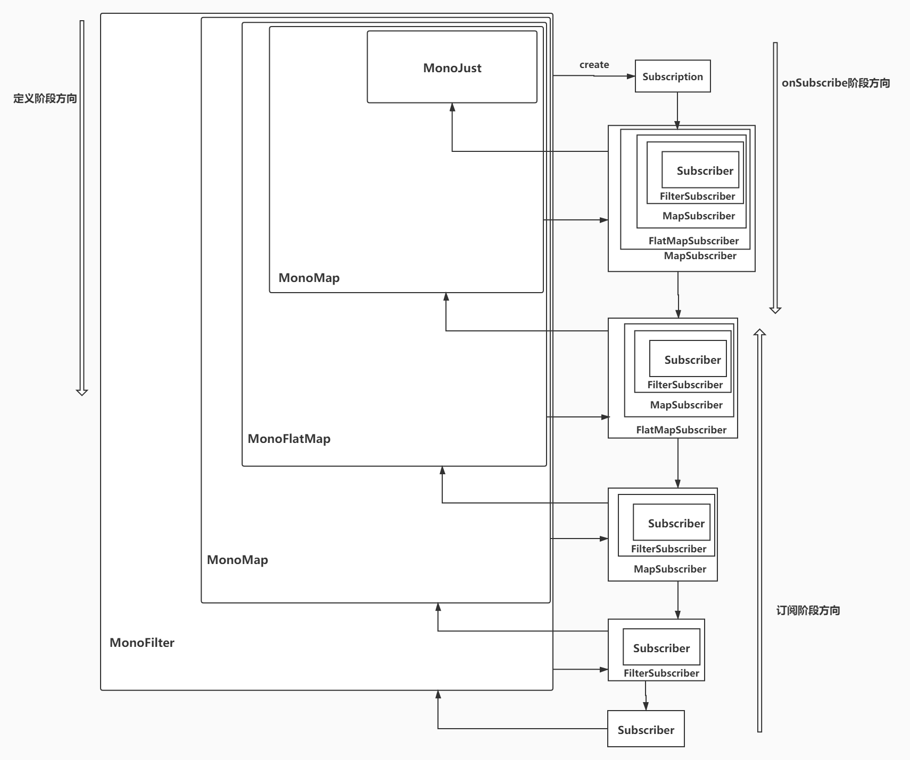
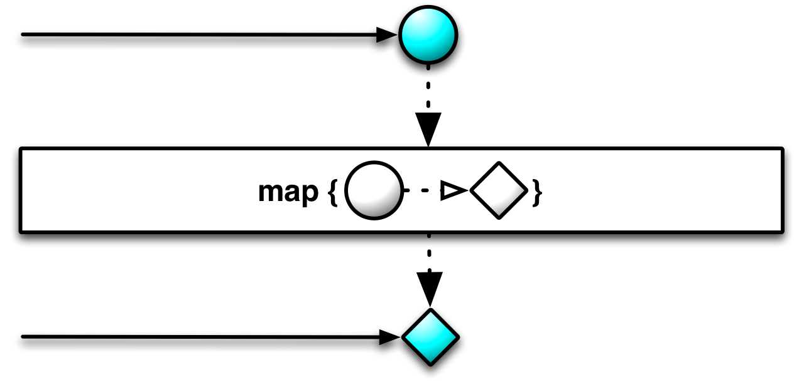
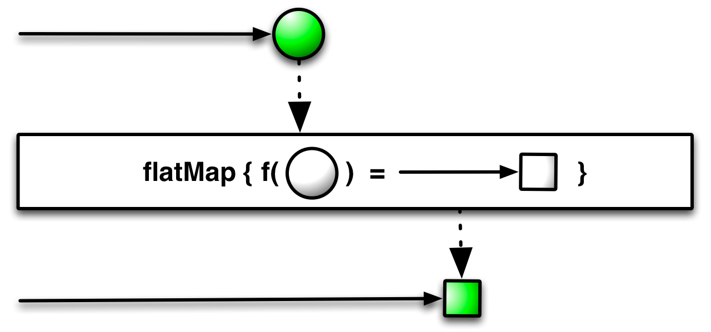

## 零
上一篇文章简单介绍了响应式编程的概念和具体的实现[Project Reactor](https://projectreactor.io/)以及[响应式流](www.reactive-streams.org)规范定义的所有接口。
这篇文章将深入内部探究Project Reactor实现原理。实际上Project Reactor实现方式和代码风格跟Rxjava非常相似，所以理解了Project Reactor内部的运行原理，那么Rxjava也八九不离十了。而且Rxjava除了Flowable之外都是没背压的，所以实现上总体会简单一点。

名字解释：
- 数据源：例如MonoJust（即Mono#just方法）、MonoDefer（即Mono#defer方法）等等。
- 操作符：例如map、flatMap等等。即创建好实例之后调用的所有对数据源进行操作的方法。
- 上游：  例如Mono.just("s").map(s -> s).flatMap() just是map的上游， map操作符是flatMap的上游。
- 下游：  跟下游相反。上例map是just的下游，flatMap是map的下游。

这里说个看源码的小技巧。
- 先熟悉一下api和使用方式，然后自己脑子里先构思一下怎么实现的，想不出来没关系，带着问题看源码。
- 把头拎出来， 这个头一般是核心接口和类。
- 先简单后复杂。先梳理简单的实现，好对这个概念有一定的理解，最后再梳理复杂的实现。
- 顺着主流程脉络往下走，可以忽略次流程。待主流程理解了之后，在选择性再非主流程。

或者你有比较好的技巧也可以。千万别干撸，不然很容易就怀疑人生。


## 正文
先从上篇文章举的例子作为这次源码分析主流程。
因为Mono发射0|1个数据，所以内部实现会稍微简单一点。先简单分析一下Mono，然后再深入Flux。
```java
            Mono.just("name")                       //创建发射单个数据的数据源Mono
                .map(str -> str + ": wang007")      //对数据进行转换
                .flatMap(str -> {                   //平铺
                    System.out.println("str -> " + str);
                    return Mono.just(str.length());
                })
                .map(len -> len + "" + len)                //再转换，转换成String的长度
                .filter(lenStr -> lenStr.length() > 5)     //过滤
                .subscribe(str -> {                        //订阅
                    System.out.println("result -> " + str);
                }, err -> {
                    System.out.println("onError");
                    err.printStackTrace();
                }, () -> {
                    System.out.println("onComplete");
                }, subscription -> subscription.request(Long.MAX_VALUE));
```
1 Mono就是Reactive Stream规范的Publisher
2 subscribe方法中的几个lambda表达式作为会组成一个Reactive Stream规范的Subscriber

在使用Mono|Flux主要有4个过程
1. 定义阶段。上面的just、map、flatMap等方法
2. 订阅阶段。上面的subscribe方法
3. onSubscribe阶段。上面subscribe方法最后一个lambda表达式: subscription->subscription.request(Long.MAX_VALUE)
4. 发射数据。 数据会从just方法内部开始往下游流动。记住：数据并不是线性流动的。先遇到flatMap，concatMap等这类操作一般是未完成的结果时，所以内部表象是流动到flatMap时好像是突然停了，待flatMap结果真正完成时，数据又从flatMap开始往下游流动

### 定义阶段
实际上，Mono|Flux中每个操作符都会创建一个新的Mono|Flux，并把原来的Mono|Flux包裹在里面。像极了俄罗斯套娃。
```java
	public final <R> Mono<R> map(Function<? super T, ? extends R> mapper) {
		if (this instanceof Fuseable) {
			return onAssembly(new MonoMapFuseable<>(this, mapper));
		}
		return onAssembly(new MonoMap<>(this, mapper));
 	}

 	public final <R> Mono<R> flatMap(Function<? super T, ? extends Mono<? extends R>>
			transformer) {
		return onAssembly(new MonoFlatMap<>(this, transformer));
	}
```
所以整个定义过程就是

这些对象Mono的子类，除了MonoJust，其他的MonoMap、MonoFlatMap等内部一般都有一个source属性保存第一个上游。

### 订阅阶段
上面的subscribe方法中lambda表达式会组成一个Subscriber的实现：**reactor.core.publisher.LambdaMonoSubscriber**
然后这个subscriber会一直往上游层层包装，一直到MonoJust。这个也像是俄罗斯套娃。
所以整个订阅过程就是

1. subscribe方法中生成subscriber传入MonoFilter中
2. 在MonoFilter中，把Subscriber包装成FilterSubscriber传入MonoMap中
3. 在MonoMap中，把FilterSubscriber包装成MapSubscriber传入MonoFlatMap中。
4. 在MonoFlatMap中，把MapSubscriber包装成FlatMapSubscriber传入MonoMap中。
5. 在MonoMap中，把FlatMapSubscriber包装成MapSubscriber传入MonoJust中。
6. 而MonoJust是真正的Mono Source。所以MonoJust会生成Subscription触发下一个阶段（onSubscribe阶段）

所以订阅阶段会把最原始的Subscriber层层包装往上游传递。所以外层包装的Subscriber会持有下游Subscriber的引用。这个引用在Project Reactor源码中一般叫**actual**

#### onSubscribe阶段
由订阅阶段分析得知Subscriber层层包装往上游传递最后到了MonoJust。MonoJust会生成Subscription往下游传递，这个Subscription就是在Reactive Stream规范中定义的，代表Publisher与Subscriber关系的对象。
1. 一般情况下操作符内的Subscriber一般也会定义成Subscription（通过继承），然后包装上游传下来的Subscription保存起来，再把自己往下游传，最后到subscribe方法定义的Subscriber对象中。
2. 然后在自定义的Subscriber#onSubscribe方法中通过调用Subscription#request请求多少数据。
3. 最终request请求方法还是会到MonoJust中。

所以整个onSubscribe过程就是


所以这个阶段已经看的出来，这个像极了管道。所以下面我会用操作符管道：表示这个一系列操作符组成的Mono|Flux。
1. 定义阶段就是铺好这个管道。
2. 订阅阶段就是疏通这个管道。
3. onSubscribe和发射数据阶段就是信息和数据在这个管道中流通，而上游发射多少数据是由下游控制的。

### 发射数据阶段
经过前3个阶段铺垫，那么这个阶段就比较简单了，直接在onSubscribe方法调用Subscription#request方法请求多少数据。
最后数据呈现在Subscriber对象中的onNext方法中。

---
通过上面的讲解，对Project Reactor运行原理有个大概的认识。现在就深入到内部，详细探究它的实现原理。
先分析核心接口，这些在Mono|Flux都是共用的。
```java
public interface CoreSubscriber<T> extends Subscriber<T> {
	default Context currentContext(){
		return Context.empty();
	}
}

public interface CorePublisher<T> extends Publisher<T> {
	void subscribe(CoreSubscriber<? super T> subscriber);
}
```
1. CoreSubscriber继承自Reactive Stream中的Subscriber。主要是提供了currentContext方法用于获取Context。
Context跟Map差不多，直接简单理解成Map都没问题，主要区别是Context是不可变的（Immutable）而且线程安全的（废话，Immutable已经包含线程安全的语义了）。
Context主要保存一些用户自定义可选的的行为。例如数据在操作符管道发生异常，如果在Context保存了对异常处理的hook方法，那么就调用hook方法处理。

2. CorePublisher继承自Reactive Stream中的Publisher。主要是代表订阅时使用CoreSubscriber，而非Subscriber。
在内部实现中，都是使用CoreSubscriber、CorePublisher，而不是Subscriber、Publisher。 例如Mono|Flux继承CorePublisher。
---
```java
public interface Disposable {

	void dispose();

	default boolean isDisposed() {
		return false;
	}
}
```
这个接口代表一个可处理的资源。这个名字定义的太抽象了。
一般情况下，dispose方法就是取消这个资源，此方法必须保证幂等。 isDisposed方法就是判断是否已经取消 或者 完成。（取消或正常完成都返回）
例如Mono|Flux subscribe方法返回一个Disposable。可以调用dispose取消发射数据。而调用isDisposed方法判断该Disposable锁代表的Mono|Flux是否已经取消发射数据或正常发射完所有的数据了。
这个接口还是使用非常频繁的。

---
```java
public interface Fuseable {
    
    //不支持融合，用于下游请求上游融合时，上游不支持下游声明的融合模式
	int NONE = 0;
    
    //同步融合。下游请求上游融合时声明同步融合模式，
    //如果上游支持同步融合模式，那么返回该值代表支持同步融合，否则返回NONE。

	int SYNC = 1;
	
	//异步融合。下游请求上游融合时声明异步融合模式，
	//如果上游支持异步融合模式，那么返回该值代表支持异步融合，否则返回NONE。
	int ASYNC = 2;
	
	//同步或异步融合。用于下游请求上游融合时声明ANY融合模式。
	//如果上游支持同步融合模式，那么返回SYNC。
	//如果上游支持异步融合模式，那么返回ASYNC。
	//如果上游不支持融合，则返回NONE。
	//切记：ANY只能用于下游请求上游融合的入参，不能作为返回参数。
	int ANY = 3;
	
	//代表能否支持跨线程融合。跨线程指下游要跨线程，例如下游操作符为publishOn。该参数配合SYNC|ASYNC|ANY任一使用才有用。
	int THREAD_BARRIER = 4;
}
```
这个接口是非常重要的，该接口也只是个标记型接口，用于描述Mono|Flux是否可融合的。上面分析得知，每个操作符都会产生新的Mono|Flux对象。
Mono|Flux还只是个抽象类，具体像MonoJust、MonoMap、MonoFlatMap等才是真正的实现，这些实现类是否继承Fuseable来表示是否可融合的Mono|Flux，而且下游的Mono来判断上游的Mono是否可融合。

```java
public interface Fuseable {

	interface QueueSubscription<T> extends Queue<T>, Subscription {
		
		int requestFusion(int requestedMode);

		//省略一些无关紧要的方法
	}
}
```
实现了Fuseable接口的Mono|Flux，执行下游的onSubscribe方法时，入参的Subscription一定是QueueSubscription类型的。因为这个入参的Subscription是上游传下来的，那么调用requestFusion方法实际上就是
对上游请求融合，入参requestedMode就是SYNC|ASYNC|ANY之一或再与上THREAD_BARRIER。例如：AYNC|THREAD_BARRIER。（|是与运算，非文字表达或的意思）

同步融合: 代表支持同步融合的上游已经准备好数据了。可直接拉取Queue#poll。如果poll方法返回null，则上游数据处理完了（接着调用onComplete方法）。

异步融合：代表支持异步融合的上游数据未准备好。当上游数据准备好，通过onNext方法通知下游数据已经准备好了，下游直接拉取Queue#poll。如果poll方法返回null，上游并不一定处理完了，可能只是暂时没数据了，上游处理完了一定会通过onComplete方法通知下游，这点跟同步融合区别很大。

为什么需要融合呢？
> 如果不支持融合的Mono|Flux，那么上游发射的数据都是通过onNext方法一个一个往下游传的。支持融合的话，下游可以一次拉取N个数据，一起处理。
如果下游操作符开销比较大的话，那么支持融合的Mono|Flux就能有效提升性能。
例如：publishOn操作符，上游每发射一个数据，它都需要切换到指定的线程池上。如果融合的话，那么直接在指定的线程池上执行拉取数据。这样就可以N个数据对应一个线程池任务了。如果没理解，没关系，下面会继续深入分析。

---
```java
public interface Scannable {
	Object scanUnsafe(Attr key);
	//省略若干代码
}
```
该接口通过scanUnsafe方法导出内部的状态，而且入参Attr一般是已经预定义好的值，在Scannable中定义。例如
```java
final class MonoJust<T> extends Mono<T> implements Fuseable.ScalarCallable<T>, Fuseable, SourceProducer<T> {
	@Override
	public Object scanUnsafe(Attr key) {
		if (key == Attr.BUFFERED) return 1;
		return null;
	}
}
```
表示MonoJust支持导出内部队列的容量大小。Scannable属于次流程接口了，可不深入了解也行。

---
Scheduler：用于调度操作符执行在某一线程池上，熟悉Rxjava的朋友一定很熟悉这个接口了。
> 一些操作符内部本身就是要依赖Scheduler才能实现的，这些情况一定要明白，不然在一些线程敏感的应用容易出问题。例如timeout操作符、delay相关的操作符等。
也就是说这些操作符在哪个线程池调度有个清晰的认识。

```java
public interface Scheduler extends Disposable {

	//往调度器中提交任务，相当于Executor#submit方法
	Disposable schedule(Runnable task);

	//往调度器中提交延时任务，相当于ScheduledExecutorService#schedule方法	
	default Disposable schedule(Runnable task, long delay, TimeUnit unit) {
		throw Exceptions.failWithRejectedNotTimeCapable();
	}

	//往调度器中提交周期性任务，相当于ScheduledExecutorService#scheduleAtFixedRate方法
	default Disposable schedulePeriodically(Runnable task, long initialDelay, long period, TimeUnit unit) {
		throw Exceptions.failWithRejectedNotTimeCapable();
	}

	//省略now方法
	

	Worker createWorker();

	//关闭调度器
	default void dispose() {
	}

	//启动调度器
	default void start() {
	}

	//Work，实现上也是把任务提交给Scheduler执行。
	//但是区别在于取消任务（dispose方法）的时候，可以把Work中所有正在执行的任务全部取消掉。
	interface Worker extends Disposable {

		//跟Scheduler一样
		Disposable schedule(Runnable task);

		//跟Scheduler一样
		default Disposable schedule(Runnable task, long delay, TimeUnit unit) {
			throw Exceptions.failWithRejectedNotTimeCapable();
		}

		//跟Scheduler一样
		default Disposable schedulePeriodically(Runnable task, long initialDelay, long period, TimeUnit unit) {
			throw Exceptions.failWithRejectedNotTimeCapable();
		}
	}
}
```
实际上，Project Reactor内部自带Scheduler的实现，也是把任务提交给Scheduler内部的ScheduledExecutorService执行，所以你把Scheduler理解成ScheduledExecutorService线程池，完全没有问题。
> 这里先挖个坑，ScheduledExecutorService是不适合做任务线程池的，它只适合做定时任务线程池的。如果ScheduledExecutorService用于跑大量非定时任务的话是非常不适合的。下次开个专题专门说说线程池的那些事。

---
## Mono
> 还是按照上面例子中的操作符讲，操作符非常多，不可能把所有操作符的实现都讲一遍，主要讲一些常用的、或者容易引起疑惑的。
笔者之前使用Rxjava使用最频繁就是flatMap、map，其次是timeout、zip、concatMap、filter，其他就比较少了。
observeOn（Project Reactor叫publishOn)与subscribeOn是最容易混淆的。

### 创建Mono
最常用的还是Mono#just（MonoJust），还有Mono#create（MonoCreate）

```java
//Mono只继承了CorePublisher，未继承Fuseable
public abstract class Mono<T> implements CorePublisher<T> {
	
	//just new MonoJust实例并返回
	//用于执行一些用户自定义的hook函数，这个不重要。
	public static <T> Mono<T> just(T data) {
		return onAssembly(new MonoJust<>(data));
	}
	//省略若干代码
}

//MonoJust继承了Fuseable，所以MonoJust是支持融合的。
//ScalarCallable是Callable的标记型接口，代表可立即产生一条数据的source
final class MonoJust<T> 
extends Mono<T>
		implements Fuseable.ScalarCallable<T>, Fuseable, SourceProducer<T>  {

	final T value;
  
	MonoJust(T value) {
		this.value = Objects.requireNonNull(value, "value");
	}

	@Override
	public T call() throws Exception {
		return value;
	}

	@Override
	public void subscribe(CoreSubscriber<? super T> actual) {
		actual.onSubscribe(Operators.scalarSubscription(actual, value));
	}
	//省略若干代码
}

//MonoJust代码的关键在于subscribe方法内，先Operators#scalarSubscription方法生成subscription，然后执行下游的onSubscribe方法。

//也只是创建个ScalarSubscription
public static <T> Subscription scalarSubscription(CoreSubscriber<? super T> subscriber,
			T value){
		return new ScalarSubscription<>(subscriber, value);
}


//支持同步融合的QueueSubscription
interface SynchronousSubscription<T> extends QueueSubscription<T> {
		@Override
		default int requestFusion(int requestedMode) {
			if ((requestedMode & Fuseable.SYNC) != 0) {
				return Fuseable.SYNC;
			}
			return NONE;
		}
}

//MonoJust支持融合，所以MonoJust创建的Subscription也一定QueueSubscription
//而这个QueueSubscription也是只有一条数据的Queue
static final class ScalarSubscription<T>
			implements Fuseable.SynchronousSubscription<T>, InnerProducer<T> {

		final CoreSubscriber<? super T> actual;

		final T value;

		//once == 1 未消费 once == 1时，已消费， 2.已取消
		volatile int once;
		ScalarSubscription(CoreSubscriber<? super T> actual, T value) {
			this.value = Objects.requireNonNull(value, "value");
			this.actual = Objects.requireNonNull(actual, "actual");
		}

		@Override
		public void cancel() {
			if (once == 0) { //这里代表数据未消费就直接丢掉，如果有hook方法就执行hook方法。
				//前面提到Context说到，会从Context取一些hook方法来执行，取不到就忽略。
				Operators.onDiscard(value, actual.currentContext());  
			}
			ONCE.lazySet(this, 2); //取消
		}

		//Queue接口方法，清除数据
		@Override
		public void clear() {
			if (once == 0) {
				Operators.onDiscard(value, actual.currentContext());
			}
			ONCE.lazySet(this, 1); //置消费位，代表已清空队列
		}

		@Override
		public boolean isEmpty() {
			return once != 0;
		}

		@Override
		public CoreSubscriber<? super T> actual() {
			return actual;
		}

		//拉取数据，并设置已消费。
		@Override
		@Nullable
		public T poll() {
			if (once == 0) {
				ONCE.lazySet(this, 1);
				return value;
			}
			return null;
		}

		@Override
		@Nullable
		public Object scanUnsafe(Attr key) {
			if (key == Attr.TERMINATED || key == Attr.CANCELLED)
				return once == 1;
			return InnerProducer.super.scanUnsafe(key);
		}

		@Override
		public void request(long n) {
			if (validate(n)) { //校验n > 0
				if (ONCE.compareAndSet(this, 0, 1)) { //竟态条件，CAS。
					Subscriber<? super T> a = actual; //下游
					a.onNext(value); //调用通知下游
					if(once != 2) { //没有取消的话，调用下游的onComplete方法
						a.onComplete(); 
					}
				}
			}
		}

		@Override
		public int requestFusion(int requestedMode) {
			if ((requestedMode & Fuseable.SYNC) != 0) { 请求包含同步融合，那么就支持同步融合。
				return Fuseable.SYNC;
			}
			return 0; //NONE,不支持融合
		}

		@Override
		public int size() {
			return isEmpty() ? 0 : 1;
		}

		@SuppressWarnings("rawtypes")
		static final AtomicIntegerFieldUpdater<ScalarSubscription> ONCE =
				AtomicIntegerFieldUpdater.newUpdater(ScalarSubscription.class, "once");
	}
```
1. 在MonoJust#subscribe方法内，调用下游（actual）#onSubscribe方法，把创建的ScalarSubscription实例往下游传。
2. 下游在onSubscribe方法中，有两种处理方式
	1. 调用request方法，那么上游就会执行下游的onNext，onComplete方法。
	2. 调用requestFusion方法请求融合，融合成功的话。上游不再通过onNext方法发射数据，而是下游通过QueueSubscription#poll手动拉取数据。

当然还有很多创建Mono实例的方式，这里不再一一列举了。


---
### map操作符


```java
public abstract class Mono<T> implements CorePublisher<T> {

	//还是创建一个Mono实例，并把原来的（this）给包装进去
	//首先判断是否支持融合的，支持融合使用MonoMapFuseable，不支持融合MonoMap
	public final <R> Mono<R> map(Function<? super T, ? extends R> mapper) {
		if (this instanceof Fuseable) {
			return onAssembly(new MonoMapFuseable<>(this, mapper));
		}
		return onAssembly(new MonoMap<>(this, mapper));
	}
}
```
MonoMapFuseable功能会包括MonoMap的，所以只讲支持融合的。
```java
//很明显这个MonoMapFuseable自身也是可融合的
final class MonoMapFuseable<T, R> extends InternalMonoOperator<T, R>
		implements Fuseable {

	final Function<? super T, ? extends R> mapper;

	MonoMapFuseable(Mono<? extends T> source, Function<? super T, ? extends R> mapper) {
		super(source);
		this.mapper = Objects.requireNonNull(mapper, "mapper");
	}

	@Override
	@SuppressWarnings("unchecked")
	public CoreSubscriber<? super T> subscribeOrReturn(CoreSubscriber<? super R> actual) {
		if (actual instanceof ConditionalSubscriber) {
			ConditionalSubscriber<? super R> cs = (ConditionalSubscriber<? super R>) actual;
			return new FluxMapFuseable.MapFuseableConditionalSubscriber<>(cs, mapper);
		}
		return new FluxMapFuseable.MapFuseableSubscriber<>(actual, mapper);
	}
}

public interface Fuseable {
	//也是Subscriber一种，其中的奥秘到tryOnNext方法中
	interface ConditionalSubscriber<T> extends CoreSubscriber<T> {
		//是否消费数据成功，true: request数 + 1，false：request数。
		//例如：request(1)时，如果返回true，此时停止发射数据。如果返回false，将继续发射数据，直到返回true或数据全部发射完毕。
		boolean tryOnNext(T t);
	}
}
```
ConditionalSubscriber主要得看上游支不支持，这个是非主流程。下面分析还是以支持融合的操作符为主线。
> ConditionalSubscriber操作符一般用在过滤数据型操作符会很常用，例如filter操作符。
例如你request(1)时，在onNext方法做统计并触发下一次的request时，由于过滤过滤掉数据了，从而不会触发onNext方法且你又无从得知，所以后续的数据不会再发射出来。
所以filter操作符在subscribe方法都会把下游包装成ConditionalSubscriber往上游传，从而避免了例子中的情况。
> 为什么Rxjava2的Observable没有这个问题呢？这里留个思考题

MonoMapFuseable继承自InternalMonoOperator，而这个InternalMonoOperator是所有Mono操作符的父类。里面主要实现了一些订阅的逻辑。
> 这里为什么还需要搞InternalMonoOperator呢？ 
实际上，只需要把下游的Subscriber包装自身操作符的Subscriber，然后再执行上游(source)的subscribe方法，就可以一直往上游传递了直到发射源（例如MonoJust）。例如Rxjava2就是这么做的。
很明显上述的做法算是一种递归。
InternalMonoOperator就是把递归变换成while循环，这种优化算是很用心了。

### InternalMonoOperator怎么把递归变循环的？
分析InternalMonoOperator之前先看它的父接口OptimizableOperator，这个父接口是Mono|Flux 操作符共用的，也就是说Flux也有个类似InternalMonoOperator的接口: InternalFluxOperator。
两者功能是一样的，分析其中之一即可。
```java
//很明显OptimizableOperator也是数据源的一种
interface OptimizableOperator<IN, OUT> extends CorePublisher<IN> {

	//子类操作符的核心业务主要是在这实现的
	//入参actual是下游，包装成本操作符的Subscriber并返回
	//返回null，代表该方法内已经处理了订阅。
	@Nullable
	CoreSubscriber<? super OUT> subscribeOrReturn(CoreSubscriber<? super IN> actual);

	//上游
	CorePublisher<? extends OUT> source();

	//优化过的上游，也就是上游类继承了OptimizableOperator。 
	//实际上所有的操作符都会直接或间接继承OptimizableOperator，但是数据源不会。（例如：MonoJust）
	//所以该方法返回null，代表已经达到数据源头了。
	@Nullable
	OptimizableOperator<?, ? extends OUT> nextOptimizableSource();
}
```
绝大多数情况下，source方法返回值跟nextOptimizableSource方法返回值一样。除了数据源头开始的第一个操作符。

```java
//MonoOperator也是一种Mono
abstract class InternalMonoOperator<I, O> extends MonoOperator<I, O> implements Scannable,
                                                                                OptimizableOperator<O, I> {

	@Nullable
	final OptimizableOperator<?, I> optimizableOperator;

	protected InternalMonoOperator(Mono<? extends I> source) {
		super(source); //保存上游引用。

		//上游是否被优化过的，也就是说上游是否为操作符。
		this.optimizableOperator = source instanceof OptimizableOperator ? (OptimizableOperator) source : null;
	}

	//这里是递归变换成while循环的关键代码。
	@Override
	public final void subscribe(CoreSubscriber<? super O> subscriber) {
		OptimizableOperator operator = this;
		while (true) {
			subscriber = operator.subscribeOrReturn(subscriber); //包装下游的Subscriber

			//在subscribeOrReturn已经处理了订阅上游，直接return就行了。
			if (subscriber == null) {
				// null means "I will subscribe myself", returning...
				return;
			}

			OptimizableOperator newSource = operator.nextOptimizableSource();  //取上游操作符。
			if (newSource == null) { //达到数据源了，直接订阅
				operator.source().subscribe(subscriber);
				return;
			}
			operator = newSource;  //把上游操作符赋值给operator，继续往上游包装subscriber。
		}
	}

	//子类实现包装下游的Subscriber
	@Nullable
	public abstract CoreSubscriber<? super I> subscribeOrReturn(CoreSubscriber<? super O> actual);

	@Override
	public final CorePublisher<? extends I> source() {
		return source;
	}

	@Override
	public final OptimizableOperator<?, ? extends I> nextOptimizableSource() {
		return optimizableOperator;
	}
}

```

说了那么多前置知识，在回到MonoMapFuseable本身。关键代码在subscribeOrReturn方法内。
```java
public CoreSubscriber<? super T> subscribeOrReturn(CoreSubscriber<? super R> actual) {
		if (actual instanceof ConditionalSubscriber) {
			ConditionalSubscriber<? super R> cs = (ConditionalSubscriber<? super R>) actual;
			return new FluxMapFuseable.MapFuseableConditionalSubscriber<>(cs, mapper);
		}
		return new FluxMapFuseable.MapFuseableSubscriber<>(actual, mapper);
}
```
也就是MapFuseableSubscriber实例。
```java
static final class MapFuseableSubscriber<T, R>
			implements InnerOperator<T, R>,
			           QueueSubscription<R> {

	final CoreSubscriber<? super R>        actual; //下游Subscriber
	final Function<? super T, ? extends R> mapper; //map变换

	boolean done;  //是否处理完

	QueueSubscription<T> s;  //上游subscription

	int sourceMode; //当前Subscriber的融合模式

	MapFuseableSubscriber(CoreSubscriber<? super R> actual,
			Function<? super T, ? extends R> mapper) {
		this.actual = actual;
		this.mapper = mapper;
	}

	public void onSubscribe(Subscription s) {
		if (Operators.validate(this.s, s)) {
			//直接转成QueueSubscription，有了前面Fuseable接口，这里转化是安全的
			this.s = (QueueSubscription<T>) s;  
			//把自身传给下游，因为也实现了QueueSubscription
			actual.onSubscribe(this);
		}
	}

	public void onNext(T t) {
		//说明下游请求异步融合了，那么通过onNext方法告知下游数据准备好了
		if (sourceMode == ASYNC) {
			actual.onNext(null);
		}
		else { //正常发射数据
			if (done) { //已完成，return
				Operators.onNextDropped(t, actual.currentContext());
				return;
			}
			R v;
			try {
				//执行变换
				//可以看出整个流程中数据是不允许为null的
				v = Objects.requireNonNull(mapper.apply(t),
						"The mapper returned a null value.");
			}
			catch (Throwable e) {
				//hook方法执行
				Throwable e_ = Operators.onNextError(t, e, actual.currentContext(), s);

				//hook方法没能消化掉error
				if (e_ != null) {
					onError(e_); //执行下游actual#onError方法，通知处理失败
				}
				else {
					//hook方法消化掉error，并再拉取一条数据
					//很明显，MonoJust会忽略掉，因为MonoJust只有一条数据
					s.request(1);
				}
				return;
			}
			//数据往下游流动
			actual.onNext(v);
		}
	}

	public void onError(Throwable t) {
		if (done) { //已经处理完成了，忽略掉
			Operators.onErrorDropped(t, actual.currentContext());
			return;
		}
		done = true; //处理完的标志位设为true
		//异常往下游流动
		actual.onError(t);
	}
	//onComplete方法跟onError类似，省略

	//请求拉取数据，直接往上游传
	public void request(long n) {
		s.request(n);
	}
	//cancel方法跟request，省略

	//处理融合。
	public int requestFusion(int requestedMode) {
		int m;
		//下游请求跨线程融合，
		//因为这里全部实现都是未保证线程安全的，所以不支持跨线程融合
		if ((requestedMode & Fuseable.THREAD_BARRIER) != 0) {
			return Fuseable.NONE;
		}
		else {
			//融合往上游传递。例如MonoJust只支持同步融合，那么sourceMode == SYNC
			m = s.requestFusion(requestedMode);
		}
		sourceMode = m;
		return m; //融合状态结果往下游传递
	}

	//融合模式拉取数据
	public R poll() {
		for(;;) {
			T v = s.poll(); //从上游拉取数据。
			if (v != null) {
				try {
					//变换，返回。
					return Objects.requireNonNull(mapper.apply(v));
				}
				catch (Throwable t) {
					RuntimeException e_ = Operators.onNextPollError(v, t, currentContext());
					if (e_ != null) {
						throw e_;
					}
					else {
						continue;
					}
				}
			}
			//如果是同步融合，返回null，代表数据已经发射完了，
			//下游需要自己调用onComplete方法，而不是由上游触发

			//如果是异步融合，代表本轮请求的数据已经处理完了
			//继续等待onNext方法收到通知再poll数据，或者收到onComplete|onError 方法通知代表上游数据已经处理完了
			return null;
		}
	}

	//省略若干代码
}
```


---
### FlatMap

```java
public abstract class Mono<T> implements CorePublisher<T> {
	public final <R> Mono<R> flatMap(Function<? super T, ? extends Mono<? extends R>>
			transformer) {
		return onAssembly(new MonoFlatMap<>(this, transformer));
	}
}

//很明显MonoFlatMap也是支持融合的
final class MonoFlatMap<T, R> extends InternalMonoOperator<T, R> implements Fuseable {

	
	public CoreSubscriber<? super T> subscribeOrReturn(CoreSubscriber<? super R> actual) {
		//判断source是否继承Callable，前面分析提到过，callable是可以直接处理的
		//非主流程，属于优化细节，不深入分析

		//里面处理过对source的subscribe，所以这里return null,跳出while循环订阅
		if (FluxFlatMap.trySubscribeScalarMap(source, actual, mapper, true, false)) { 
			return null;
		}

		//FlatMapMain既是QueueSubscription，又是Subscriber
		FlatMapMain<T, R> manager = new FlatMapMain<>(actual, mapper);
		
		//先把QueueSubscription往下游传，可以request请求到FlatMapMain
		//然后source#onSubscribe传下来Subscription，已经明确需要拉取的数据量大小了，也算是一个优化点
		actual.onSubscribe(manager);

		//返回Subscriber继续while循环订阅，直到数据源头
		return manager;
	}
	//省略FlatMapMain实现类
}
```

---


