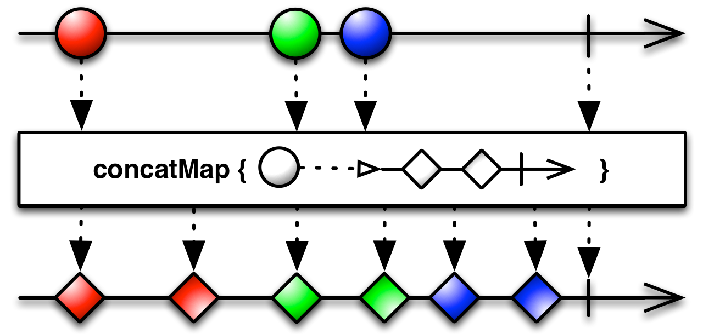

## 零
在两篇文章把Mono分析过了，其中绝大部分概念都是通用的，甚至代码基本都一样或者共用的，所以那部分我会直接跳过或提示一下

Mono是发射0|1条数据的Publisher。
Flux是发射0|N条数据的Publisher，所以总体上Flux的实现会复杂一点。

## 正文

```java
public abstract class Flux<T> implements CorePublisher<T> {

}
```
跟Mono一样，也只是实现了CorePublisher，融合接口（Fuseable）将会在操作符中实现。

### 创建Flux
> 创建Flux的方式有很多种，还是使用最常使用的Flux#just

### just操作符
```java
public static <T> Flux<T> just(T... data) {
		return fromArray(data);
}
public static <T> Flux<T> fromArray(T[] array) {
	//不发射数据，只调用onComplete方法
	if (array.length == 0) {
		return empty();
	}
	//发射一条数据的Flux
	if (array.length == 1) {
		return just(array[0]);
	}
	return onAssembly(new FluxArray<>(array));
}
```
FluxArray才是最后发射多条数据的Flux
```java
final class FluxArray<T> extends Flux<T> implements Fuseable, SourceProducer<T> {

	final T[] array;

	@SafeVarargs
	public FluxArray(T... array) {
		this.array = Objects.requireNonNull(array, "array");
	}

	//s是下游
	public static <T> void subscribe(CoreSubscriber<? super T> s, T[] array) {
		if (array.length == 0) {
			Operators.complete(s);
			return;
		}
		//ConditionalSubscriber在分析Mono的时候分析过了
		if (s instanceof ConditionalSubscriber) {
			s.onSubscribe(new ArrayConditionalSubscription<>((ConditionalSubscriber<? super T>) s, array));
		}
		else {
			s.onSubscribe(new ArraySubscription<>(s, array));
		}
	}


	@Override
	public void subscribe(CoreSubscriber<? super T> actual) {
		subscribe(actual, array);
	}

	@Override
	public Object scanUnsafe(Attr key) {
		//return数组的长度
		if (key == Attr.BUFFERED) return array.length;

		return null;
	}
}
```
很显然，FluxArray是支持融合的
重点在subscribe方法，最后调用了下游（CoreSubscriber）的onSubscribe方法，入参是ArraySubscription实例
```java
static final class ArraySubscription<T>
			implements InnerProducer<T>, SynchronousSubscription<T> {

	final CoreSubscriber<? super T> actual;	//下游Subscriber
	final T[] array;
	int index;

	volatile boolean cancelled;

	volatile long requested;
	//去掉一些代码

	//第1步：下游获取到SynchronousSubscription时，会调用request到一直到当前的request方法
	@Override
	public void request(long n) {
		if (Operators.validate(n)) {
			//addCap是get and compareAndSet的操作
			// == 0 表示当前没有正在执行向下游发射的操作
			if (Operators.addCap(REQUESTED, this, n) == 0) {
				//下游请求拉满，全部发射出去
				if (n == Long.MAX_VALUE) {
					fastPath();
				}
				//下游按需拉取
				else {
					slowPath(n);
				}
			}
		}
	}

	//第2步：下游按需拉取
	void slowPath(long n) {
		final T[] a = array;
		final int len = a.length;
		final Subscriber<? super T> s = actual;

		int i = index;	//当前数据发射到第几条数据的索引
		int e = 0;

		for (; ; ) {
			if (cancelled) { //下游调用了cancel方法
				return;
			}

			while (i != len && e != n) {
				T t = a[i];

				//很显然，数组中的item不允许为空
				if (t == null) {
					s.onError(new NullPointerException("The " + i + "th array element was null"));
					return;
				}
				//向下游发射数据
				s.onNext(t);

				if (cancelled) {
					return;
				}

				i++;
				e++;
			}

			//数据全部发射完，向下游发射onComplete通知
			if (i == len) {
				s.onComplete();
				return;
			}

			//当前的请求量
			n = requested;

			//if分支，执行当前方法过程中下游都没有执行request方法来增加请求量
			if (n == e) {
				index = i;	//保存当前已经处理到哪个数据了
				n = REQUESTED.addAndGet(this, -e);	//把当前处理过的请求量减下来并获取最终结果
				if (n == 0) {
					return;	//n == 0，则当前请求量已经处理完了
				}
				//n != 0，进入if(n == e)分支过程中，下游有request，那么进入上面的while继续处理
				e = 0;
			}
			//不满足if分支，则执行过程中下游有执行过request方法来增加数据量，
			//再次进入上面的while循环向下游发射数据
		}
	}

	//第2步：如果下游请求拉满，那么就进入这个方法
	//fastPath方法的处理就简单多了，一股脑全部发射出去即可
	void fastPath() {
		final T[] a = array;
		final int len = a.length;
		final Subscriber<? super T> s = actual;

		for (int i = index; i != len; i++) {
			if (cancelled) {
				return;
			}

			T t = a[i];

			if (t == null) {
				s.onError(new NullPointerException("The " + i + "th array element was null"));
				return;
			}
			s.onNext(t);
		}
		if (cancelled) {
			return;
		}
		s.onComplete();
	}

	//-------------
	//FluxArray是支持融合的，所以下游也可能请求融合

	//第1步：调用requestFusion方法请求融合
	@Override
	default int requestFusion(int requestedMode) {
		//只支持同步融合。
		if ((requestedMode & Fuseable.SYNC) != 0) {
			return Fuseable.SYNC;
		}
		return NONE;
	}

	//第2步: 下游收到支持同步融合之后，就主动调用poll方法拉取上游的数据
	@Override
	@Nullable
	public T poll() {
		int i = index;
		T[] a = array;
		if (i != a.length) {
			T t = a[i];
			Objects.requireNonNull(t);
			index = i + 1;
			return t;
		}
		//同步融合返回null，则上游数据已经排干了
		return null;
	}
	//省略若干代码
}
```
跟MonoJust的实现是类似的，数据源的核心逻辑都会到Subscription的实现内

在分析Mono时，最上游或者说数据源头并没有ConditionalSubscriber类型做处理，因为Mono就发射一条数据，所以没必要处理。
但是Flux不一样，有发射多条数据的情况下是需要处理的。FluxArray#subscribe方法内，当下游subscriber类型是ConditionalSubscriber时，创建的是ArrayConditionalSubscription实例。
ArrayConditionalSubscription的处理，跟上面分析的ArraySubscription处理是基本一样的，唯一的区别在于slowPath方法内。
```java
void slowPath(long n) {
	final T[] a = array;
	final int len = a.length;
	final ConditionalSubscriber<? super T> s = actual;
	int i = index;
	int e = 0;
	for (; ; ) {
		if (cancelled) {
			return;
		}
		while (i != len && e != n) {
			T t = a[i];
			if (t == null) {
			    s.onError(new NullPointerException("The " + i + "th array element was null"));
			    return;
			}
			//其他都一样，区别在这，调用的是tryOnNext
			//true：代表数据被下游正常消费掉
			//false: 代表数据没有被下游正常消费掉，例如被过滤掉等处理
			boolean b = s.tryOnNext(t);
			
			if (cancelled) {
				return;
			}
			
			i++;
			//所以只有下游被正常消费掉，处理的数据才会计算到request的请求数据量上。
			if (b) {
			  e++;
			}
		}
		if (i == len) {
		    s.onComplete();
		    return;
		}
		n = requested;
		if (n == e) {
		  index = i;
		  n = REQUESTED.addAndGet(this, -e);
		  if (n == 0) {
			return;
		  }
		  e = 0;
		}
	}
}
```
区别就是上面注释的两处了，fastPath方法不需要处理ConditionalSubscriber的情况是因为fastPath方法本来就发射全部数据的，即使下游某一数据被filter过滤掉了那么下一条数据也还会接踵而来。

---
Filter操作符

```java
public final Flux<T> filter(Predicate<? super T> p) {
		if (this instanceof Fuseable) {
			return onAssembly(new FluxFilterFuseable<>(this, p));
		}
		return onAssembly(new FluxFilter<>(this, p));
}
```
filter操作符有处理融合，分析可融合的FluxFilterFuseable
```java
final class FluxFilterFuseable<T> extends InternalFluxOperator<T, T> implements Fuseable {

	final Predicate<? super T> predicate;

	FluxFilterFuseable(Flux<? extends T> source, Predicate<? super T> predicate) {
		super(source);
		this.predicate = Objects.requireNonNull(predicate, "predicate");
	}

	@Override
	public CoreSubscriber<? super T> subscribeOrReturn(CoreSubscriber<? super T> actual) {
		if (actual instanceof ConditionalSubscriber) {
			return new FilterFuseableConditionalSubscriber<>((ConditionalSubscriber<? super T>) actual,
					predicate);
		}
		return new FilterFuseableSubscriber<>(actual, predicate);
	}
}
```
InternalFluxOperator跟前面分析的InternalMonoOperator实现基本一样。
关键在subscribeOrReturn方法内，先判断下游是否为ConditionalSubscriber。ConditionalSubscriber分析过了，这个次流程就不再分析了。

FilterFuseableSubscriber实例
```java
//FilterFuseableSubscriber继承了ConditionalSubscriber

static final class FilterFuseableSubscriber<T>
			implements InnerOperator<T, T>, QueueSubscription<T>, ConditionalSubscriber<T> {

	final CoreSubscriber<? super T> actual;	//下游的CoreSubscriber
		final Context                   ctx;

		final Predicate<? super T> predicate;

		QueueSubscription<T> s; //上游

		boolean done;	//是否完成

		int sourceMode;	//融合模式

		//第1步：向上游订阅时，上游最终会调用下游的onSubscribe
		public void onSubscribe(Subscription s) {
			if (Operators.validate(this.s, s)) {
				this.s = (QueueSubscription<T>) s;
				actual.onSubscribe(this);	//继续往下游传递onSubscribe方法
			}
		}

		//第2步：下游onSubscribe执行时，因为filter操作符是支持融合的，所以下游可能会调用融合
		public int requestFusion(int requestedMode) {
			int m;
			//当前类没有实现线程安全，所以不支持跨线程融合
			if ((requestedMode & Fuseable.THREAD_BARRIER) != 0) {
				return Fuseable.NONE;
			}
			else {
				//继续上游请求融合，假如上游是FluxArray，那么是m = SYNC。 即同步融合
				m = s.requestFusion(requestedMode);
			}
			sourceMode = m;
			return m;
		}

		//如果是同步融合，下游就不需要调用request方法，因为上游数据都已经准备好，
		//直接调用QueueSubscription#poll拉取即可

		//如果是异步融合，下游也需要调用request方法，通知上游可以发送数据了
		//当然下游不一定会执行融合，如果不融合的话，也是会调用request方法

		//第3步： request方法也是直接往上游请求
		public void request(long n) {
			s.request(n);
		}

		//假如下游是异步融合，或者不融合时来到第4步
		//第4步：
		public void onNext(T t) {
			//异步融合，通过onNext方法通知下游数据已准备好
			if (sourceMode == ASYNC) {
				actual.onNext(null);
			}
			else {
				if (done) {
					Operators.onNextDropped(t, this.ctx);
					return;
				}
				boolean b;

				try {
					//直接filter操作符 test
					b = predicate.test(t);
				}
				catch (Throwable e) {
					//省略error处理代码
				}
				if (b) { //test通过，执行下游的onNext方法
					actual.onNext(t);
				}
				else {
					s.request(1);	//test不通过，把上游消耗的一个请求量加回去
					Operators.onDiscard(t, this.ctx);
				}
			}
		}

		//调用tryOnNext的话，一定是没有融合的
		public boolean tryOnNext(T t) {
			if (done) {
				Operators.onNextDropped(t,  this.ctx);
				return false;
			}

			boolean b;

			try {
				b = predicate.test(t);
			}
			catch (Throwable e) {
				//省略error处理代码
			}
			//filter操作符 test通过，执行下游的onNext方法
			if (b) {
				actual.onNext(t);
			}
			else {
				//跟onNext方法的区别是即使test没通过，
				//也不需要向上游请求request(1)
				Operators.onDiscard(t,  this.ctx);
			}
			//上游根据返回值能判断，如果不明白的话，再回到上面看看FluxArray的处理
			return b;
		}


		//如果调用了requestFusion方法，同步或异步融合时，下游会调用当前类的poll方法
		//第5步
		public T poll() {
			//if分支会对异步融合的处理
			if (sourceMode == ASYNC) {
				long dropped = 0;	//用过统计被过滤的数据量
				for (; ; ) {
					//poll上游的数据
					T v = s.poll();
					try {
						if (v == null || predicate.test(v)) {
							if (dropped != 0) {
								request(dropped);	//丢掉的数据量加回去
							}
							return v;	//test通过，poll方法返回数据
						}
						Operators.onDiscard(v, this.ctx);
						dropped++;	//test不通过，累加被过滤掉的数据量
					}
					catch (Throwable e) {
						//省略error处理代码
					}
				}
			}
			// else分支是对同步融合的处理
			else {
				for (; ; ) {
					T v = s.poll();
					try {
						//v == null往下发射时，代表数据已发射完了
						if (v == null || predicate.test(v)) {
							return v;
						}
						Operators.onDiscard(v, this.ctx);
					}
					catch (Throwable e) {
						//省略error处理代码
					}
				}
			}
		}

	//省略若干代码
}
```

---
### flatMap
接着分析flatMap操作符，虽然Mono已经分析过flatMap操作符，但是Flux涉及到多个新数据源处理，所以会比Mono复杂一点。

正如图片显示的那样，上游的每一条数据都会产生一条新的数据源，然后这些数据源汇聚到一起。这些数据发射是无序的。看图片中下游的第3-6个元素，并没有两个绿色的菱形在前面。

```java
public final <R> Flux<R> flatMap(Function<? super T, ? extends Publisher<? extends R>> mapper) {
		return flatMap(mapper, Queues.SMALL_BUFFER_SIZE, Queues
				.XS_BUFFER_SIZE);
}

//最终调用到
//delayError: 是否延迟通知错误。true：异常发生时，先排空数据，最后再通知onError方法。 false：立马通知。
//concurrency：向上游调用request方法指定请求的数据量，默认是256
//prefetch: 对flatMap产生的新数据源请求的数据量的大小，即新数据源执行request入参的大小
final <V> Flux<V> flatMap(Function<? super T, ? extends Publisher<? extends
			V>> mapper, boolean delayError, int concurrency, int prefetch) {
		return onAssembly(new FluxFlatMap<>(
				this,
				mapper,
				delayError,
				concurrency,
				Queues.get(concurrency),
				prefetch,
				Queues.get(prefetch)
		));
}
```
上面flatMap的delayError是false，即立马通知。
delayError = true的话是flatMapDelayError操作符的。两者最终用同一个实现，只是入参delayError不一样。

接着看FluxFlatMap
```java
final class FluxFlatMap<T, R> extends InternalFluxOperator<T, R> {

	final Function<? super T, ? extends Publisher<? extends R>> mapper;	//变换函数
	final boolean delayError;
	final int maxConcurrency;
	final Supplier<? extends Queue<R>> mainQueueSupplier; //主队列工厂，用于优化新数据源时接收新数据源的数据
	final int prefetch;
	final Supplier<? extends Queue<R>> innerQueueSupplier; //内部队列工厂，用于保存新数据源发射的数据

	public CoreSubscriber<? super T> subscribeOrReturn(CoreSubscriber<? super R> actual) {
		//优化分支，实际上对Callable接口类型的上游（Flux）进行优化
		if (trySubscribeScalarMap(source, actual, mapper, false, true)) {
			return null;
		}

		return new FlatMapMain<>(actual,
				mapper,
				delayError,
				maxConcurrency,
				mainQueueSupplier,
				prefetch, innerQueueSupplier);
	}

	//省略若干代码
}	
```
flatMap操作符并未对上游进行融合处理，而且它本身也不支持融合。但是它对mapper生成的新数据源做融合处理。

跟以往的基本一样，FlatMapMain既是CoreSubscriber也是也是Subscription
```java
static final class FlatMapMain<T, R> extends FlatMapTracker<FlatMapInner<R>>
		implements InnerOperator<T, R> {

		//这里非常多属性，上面FluxFlatMap提到的就不再介绍了

		//maxConcurrency == Integer.MAX_VALUE ? Integer.MAX_VALUE : (maxConcurrency - (maxConcurrency >> 2))
		//跟maxConcurrency有关，就是上游发射的数据量处理达到limit时，再次请求向上游拉取
		final int  limit;

		volatile Queue<R> scalarQueue;	//mainQueueSupplier生成的

		volatile Throwable error;

		volatile boolean done; //是否完成

		volatile boolean cancelled;

		Subscription s;

		volatile long requested;	//下游请求的数据量

		//代表是否正在执行往下游发射数据，wip == 0,没有执行
		//主要用于防并发
		volatile int wip;	

		int lastIndex;
		int produced;


		//第1步：跟其他一样，订阅发射时，上游会向下游通知onSubscribe方法
		public void onSubscribe(Subscription s) {
			if (Operators.validate(this.s, s)) {
				this.s = s;
				actual.onSubscribe(this); //继续往下游传递通知

				//同时向上游拉取数据量通知，入参是flatMap中的concurrency
				s.request(Operators.unboundedOrPrefetch(maxConcurrency));
			}
		}

		//第2步：上游收到request方法的请求通知时，会向下游发射数据
		public void onNext(T t) {
			//省略
			Publisher<? extends R> p;
			try {
				//mapper方法，产生新数据源
				p = Objects.requireNonNull(mapper.apply(t), "The mapper returned a null Publisher");
			}
			catch (Throwable e) {
				//省略
			}

			//这个if分支对mapper方法生成的新数据源类型是Callable的优化
			if (p instanceof Callable) {
				R v;
				try {
					v = ((Callable<R>) p).call();
				}
				catch (Throwable e) {
					//省略
				}
				//这个v是新数据源产生的
				//该方法直接往下游发射数据或者保存到scalarQueue队列中
				tryEmitScalar(v);
			}
			//非优化分支
			else {
				//这个inner既是CoreSubscriber也是Subscription
				FlatMapInner<R> inner = new FlatMapInner<>(this, prefetch);
				if (add(inner)) {
					p.subscribe(inner); //对新数据源做订阅
				}
			}
		}
}

```
onNext方法中，if (p instanceof Callable)分支里，其中调用到tryEmitScalar方法，在这个方法内执行了mainQueueSupplier生成scalarQueue队列的操作，仅仅是这里用到了mainQueueSupplier。
接下来分析的主流程还是按照正常主流程分支继续分析，即上面的else分支。既然是FlatMapInner去订阅新数据源，那么从FlatMapInner继续
```java

static final class FlatMapInner<R> implements InnerConsumer<R>, Subscription {
		final FlatMapMain<?, R> parent;	
		final int prefetch;	//对新数据源请求的数据量
		final int limit; //跟上面分析的一样

		volatile Subscription s;

		//统计已经处理了多少数据量了，用于再次request上游
		long produced;	

		//有可能上游传下来的QueueSubscription，
		//也有可能是innerQueueSupplier生成的
		//取决于融合情况
		volatile Queue<R> queue;

		volatile boolean done;

		int sourceMode;

		int index;

		FlatMapInner(FlatMapMain<?, R> parent, int prefetch) {
			this.parent = parent;
			this.prefetch = prefetch;
			this.limit = Operators.unboundedOrLimit(prefetch);
		}

		//在第2步（即上面分析的FlatMapMain#onNext方法），已经对新数据源进行了subscribe

		//第3步：那么新数据源作为“新”上游，会调用到该类的onSubscribe方法
		public void onSubscribe(Subscription s) {
			if (Operators.setOnce(S, this, s)) {
				//判断是否是可融合的
				if (s instanceof Fuseable.QueueSubscription) {
					 Fuseable.QueueSubscription<R> f = (Fuseable.QueueSubscription<R>) s;
					//先对新上游请求融合
					int m = f.requestFusion(Fuseable.ANY | Fuseable.THREAD_BARRIER);

					//新上游支持融合
					if (m == Fuseable.SYNC) {
						sourceMode = Fuseable.SYNC; 
						queue = f;		//保存上游的QueueSubscription，因为是同步融合，直接poll数据直到返回null表示结束即可
						done = true;
						parent.drain();
						return;	//返回，不需要向上游请求发射的数据量
					}

					//新上游异步融合
					if (m == Fuseable.ASYNC) {
						sourceMode = Fuseable.ASYNC; //设置融合模式
						queue = f;
					}
				}
				//异步融合或不支持融合时，向上游请求发射的数据量
				s.request(Operators.unboundedOrPrefetch(prefetch));
			}
		}

	}
```
上面分析的onSubscribe方法，分析了那么多融合模式的代码，终于见到一次融合模式的发起者。之前分析要么融合处理的源头（FluxArray），要么就是融合处理的中间过程（map、filter操作符等等）。
上面关于融合模式的处理就像是模板代码一样，基本所有融合模式的处理都像上面这样处理。
1. if (m == Fuseable.SYNC): 同步融合，直接先把是否处理完标志位done = true，直接对上游的QueueSubscription不断的poll，直到返回null代表结束。（可选的向下游执行onComplete方法，当然这里不需要）
2. if (m == Fuseable.ASYNC)：异步融合，先得请求上游准备好数据，准备之后调用下游的onNext方法表示通知，下游收到通知之后，对上游的QueueSubscription不断的poll，直到返回null代表本次数据量已发送完，可再次向上游调用request请求发射数据，直到上游发射onComplete或onError方法，通知异步融合已处理完成。

还是上面的FlatMapInner，假如是异步融合或者不支持融合，即调用上游的request，最终会执行到FlatMapInner#onNext方法
```java
static final class FlatMapInner<R> implements InnerConsumer<R>, Subscription {
	
	final FlatMapMain<?, R> parent;

	public void onNext(R t) {
		if (sourceMode == Fuseable.ASYNC) {
			parent.drain();
		}
		else {
			parent.tryEmit(this, t);
		}
	}
}
```
最终还是回到FlatMapMain内处理。
1. onNext方法内如果是异步融合模式，调用的是FlatMapMain#drain方法，上面FlatMapInner#onSubscribe方法内的同步融合模式时调用的也是这个drain方法。
2. 如果不支持同步融合处理，那么调用的是FlatMapMain#tryEmit方法。

下面FlatMapMain#drain、tryEmit方法并列为第4步
先分析tryEmit方法
```java
//入参inner是mapper生成新数据源的subscriber，v是新数据源发射的数据
void tryEmit(FlatMapInner<R> inner, R v) {
	//wip是竟态条件，
	if (wip == 0 && WIP.compareAndSet(this, 0, 1)) {
		long r = requested;	//下游请求的数据量	
		Queue<R> q = inner.queue;

		//当下游有request时，且队列为空时
		if (r != 0 && (q == null || q.isEmpty())) {
			actual.onNext(v); //直接往下游发射
			//如果不是拉满的话，减少请求数量
			if (r != Long.MAX_VALUE) {
				REQUESTED.decrementAndGet(this);
			}
			//新数据源消费了一条数据，累加一下
			inner.request(1);
		}
		//下游没有request或队列不为空
		else {
			if (q == null) {
				q = getOrCreateInnerQueue(inner);
			}
			//保存到队列中
			if (!q.offer(v) && failOverflow(v, inner)){
				inner.done = true;
				drainLoop();
				return;
			}
		}
		//把cas = 1的值减下来
		//如果 != 0，则这处理过程中有其他地方请求处理，那么调用drainLoop继续处理
		//如果 == 0，则这处理过程中没有其他地方请求处理，直接结束即可。
		if (WIP.decrementAndGet(this) == 0) return;
		
		drainLoop();
	}
	//wip失败，则此时有其他地方在处理，直接入队并请求处理
	else {
		Queue<R> q = getOrCreateInnerQueue(inner);
		
		if (!q.offer(v) && failOverflow(v, inner)) {
			inner.done = true;
		}
		drain();
	}
}
```
tryEmit方法用于新数据源不支持融合的情况。
wip属性：
1. wip == 0时，代表此时没有正在执行发射数据的操作。此时请求处理发射数据时（drain方法），会执行发射数据
2. wip != 0时，说明此时有正在执行发射数据的操作。此时请求处理发射数据会累加到wip中。drainLoop处理完一次循环时，会判断处理期间wip是否有累加，有的话，继续处理发射数据，处理完之后把本次累加的值（并不一定是1，是n）给减下来。周而复始，直到wip == 0
3. wip保证了只有一个线程执行对下游发射数据。
4. wip在源码内有多处使用，使用缘由基本是一样的。这是一个非常巧妙的设计。

```java
void drain() {
	if (WIP.getAndIncrement(this) != 0) {
		return;
	}
	drainLoop();
}
```
前面分析的FlatMapInner，在onSubscribe方法内对新数据源同步融合处理，或者onNext方法内对异步融合处理，还有刚分析的tryEmit方法内都有调用drain方法。
drain方法内对wip getAndIncrement。如果wip == 0时，说明竟态条件获取成功，然后直接drainLoop方法，drainLoop方法才是关键。
> tryEmit方法能直接调用drainLoop方法是因为持有wip的竟态条件还没有释放。

drainLoop方法看起来代码很大，实际上很简单，对两种队列进行处理。即获取两种队列的数据向下游发射。
1. 第一种队列就是FlatMapMain#onNext方法对新数据源优化处理时，新数据源的数据可能进入到scalarQueue队列中
2. 第二种队列就是对新数据源进行订阅的FlatMapInner，onSubscribe方法内的处理会持有对上游的队列（融合模式）或者tryEmit方法新创建的队列（调用getOrCreateInnerQueue，不融合模式）
```java
void drainLoop() {
	int missed = 1; //wip需要递减的值，第一次进来肯定是1
	final Subscriber<? super R> a = actual;	//下游
	for (; ; ) {
		//是否已完成，包括正常完成或异常完成
		//异常完成也包括新数据源发生异常
		boolean d = done;
		
		//新数据源的全部subscriber
		FlatMapInner<R>[] as = get();
		
		int n = as.length;
		
		//保存新数据源优化后数据的队列
		Queue<R> sq = scalarQueue;
		//
		//判断新数据源的全部subscribe，是否为空
		boolean noSources = isEmpty();
		//
		//检查是否完成
		if (checkTerminated(d, noSources && (sq == null || sq.isEmpty()), a)) {
			return;
		}
		
		boolean again = false;
		
		long r = requested;	//下游请求的数据量
		long e = 0L;	//统计一次循环处理的数据量
		long replenishMain = 0L; //记录flatMap操作符对上游发射数据量的处理
		
		//第1个if分支，先处理scalarQueue队列的数据
		if (r != 0L && sq != null) {
			while (e != r) {
				d = done;
				R v = sq.poll();
				boolean empty = v == null;
				//
				//状态检查
				if (checkTerminated(d, false, a)) {
					return;
				}
				//队列空了，跳出来
				if (empty) {
					break;
				}
				//处理发射
				a.onNext(v);
				e++;
			}

			if (e != 0L) {
				replenishMain += e; //统计处理过的数据量
				if (r != Long.MAX_VALUE) {
					r = REQUESTED.addAndGet(this, -e); //request请求的数据量也减下来
				}
				e = 0L; 
				again = true;
			}
		}

		//经过第1个if分支对request数据量处理,下游请求的request数据量还有剩余，继续处理
		//第2个if分支对新数据源的subscriber队列处理
		if (r != 0L && !noSources) {
			//
			//上一次处理到的subscriber索引标记位
			int j = lastIndex;	
			//
			for (int i = 0; i < n; i++) {
				if (cancelled) {
					//cancel处理，省略代码
				}
				//
				FlatMapInner<R> inner = as[j]; //取出subscriber
				if (inner != null) {
					d = inner.done; //新数据源是否处理完成
					Queue<R> q = inner.queue;
					//已处理完，移除掉
					if (d && q == null) {
						remove(inner.index);
						again = true;
						
						replenishMain++;
					}
					//未处理完且者队列不为空
					else if (q != null) {
					  while (e != r) {
					   d = inner.done;
					   R v;
					   try {
						   //取出数据
						   v = q.poll();
					   }
					   catch (Throwable ex) {
						   //error处理，省略代码
					   }
					   
					   //队列是否为空，这里分两种同步、异步融合两种情况
					   boolean empty = v == null;
					   
					   //状态检查
					   if (checkTerminated(d, false, a)) {
						   return;
					   }
					   
					   //1.同步融合时，先执行done = true，所以empty == true,该数据源一定是处理完了
					   //2.异步融合时，需要新数据源上游发射onComplete时，才执行done = true,所以不一定处理完了
					   if (d && empty) {
						   remove(inner.index);
						   again = true;
						   replenishMain++;
						   break;
					   }
					   //
					   //队列空了，跳出对当前subscriber的处理
					   if (empty) {
						   break;
					   }
					   
					   //向下游发射数据
					   a.onNext(v);
					   
					   e++   						  
					  } //while end
					  
					  if (e == r) {
						  d = inner.done;
						  boolean empty = q.isEmpty();
						  //如上
						  if (d && empty) {
							  remove(inner.index);
							  again = true;
							  replenishMain++;
						  }
					  }
					  
					  //这个if分支表示有进行新数据源的处理
					  if (e != 0L) {
						  if (!inner.done) {
							  inner.request(e);
						  }
						  if (r != Long.MAX_VALUE) {
							  r = REQUESTED.addAndGet(this, -e); //递减request的数据量
							  //
							  //下游request的数据量全部消耗完了，
							  //退出当前对新数据源subscriber的处理，进入第3个大if
							  if (r == 0L) {
								  break; // 0 .. n - 1
							  }
						  }
						  e = 0L;  						
					  }
					}
					
				} //if (inner != null)  end

				//如上
				if (r == 0L) {
					break;
				}
				//
				//越界处理
				if (++j == n) {
					j = 0;
				}
				
			} //for end
			
			//记录当前处理到第几个新数据源subscriber的索引，
			//对应当前大if开头的处理
			lastIndex = j; 
		}

		//当下游请求的数据量消耗完了，且subscriber数组还存在
		//扫描清除新数据源的subscriber数组，
		//这个if属于优化操作
		if (r == 0L && !noSources) {
		  as = get();
		  n = as.length;
		  
		  for (int i = 0; i < n; i++) {
			  //下游是否执行cancel
			  if (cancelled) {
				  Operators.onDiscardQueueWithClear(scalarQueue, actual.currentContext(), null);
				  scalarQueue = null;
				  s.cancel();
				  unsubscribe();
				  return;
			  }
			  
			  FlatMapInner<R> inner = as[i];
			  if (inner == null) {
				  continue;
			  }
			  
			  d = inner.done;
			  Queue<R> q = inner.queue;
			  boolean empty = (q == null || q.isEmpty());
			  
			  // if we have a non-empty source then quit the cleanup
			  if (!empty) {
				  break;
			  }
			  
			  if (d && empty) {
				  remove(inner.index);
				  again = true;
				  replenishMain++;
			  }
		  }
		} //if end

		if (replenishMain != 0L && !done && !cancelled) {
			//根据flatMap处理了多少条数据发射的数据，在向上游请求发射
			s.request(replenishMain);
		}
		
		if (again) {
			continue;
		}

		//先把处理过的请求drain值减掉，然后获取在这次处理的过程中，有多少次请求drain方法，
		//下一次循环处理完，再次回到这里时，再减掉，周而复始，
		//直到wip == 0
		missed = WIP.addAndGet(this, -missed);
		if (missed == 0) {
		  break;
		}
	}
}
 ```
 下游拉取数据的request方法
 ```java
public void request(long n) {
	if (Operators.validate(n)) {
		Operators.addCap(REQUESTED, this, n);
		drain();
	}
}
 ```
调用也是调用到drain方法，最后去到drainLoop方法

总结一下flatMap处理的整个过程
1. FlatMapMain#onSubscribe方法，上游request发射maxConcurrency条数据。maxConcurrency默认值是256.
2. 上游发射数据到onNext方法时，对数据进行mapper转换成新的数据源并订阅。上游每产生一条数据源转换并订阅一条。
3. 当新数据调用onSubscribe方法或发射数据时，触发调用drain方法。
4. 在drain方法内调用drainLoop方法对新数据源在各自队列中的数据进行处理。

经过对flatMap操作符过程的分析，在对上游发射的数据立即mapper转换订阅（即过程2），那么订阅后这些新数据的数据完成是无序的，有可能第一个新数据源最后一个才数据完成。很显然它是无序的。

而concatMap跟flatMap的区别主要是在过程2。当上游发射数据时，判断当前是否有新的数据源正在处理（处理指订阅、发射数据、发射onComplete）。如果有则等待新数据源处理完之后再处理。
所以concatMap就保证了有序。
> 虽然concatMap保证了有序，但是很明显整个处理过程都是串行的。那么很可能会影响系统的响应时间。

---
### concatMap

相比flatMap操作符的无序处理，concatMap的有序处理显得简单很多。
1. 上游发射一条数据，mapper转换生成新数据源订阅处理。
2. 当新数据源处理完时，再把上游发射的数据用mapper转换成新数据源订阅处理，周而复始直至上游所有的数据处理完。

```java
public final <V> Flux<V> concatMap(Function<? super T, ? extends Publisher<? extends V>>
		mapper) {
	return concatMap(mapper, Queues.XS_BUFFER_SIZE);
}

public final <V> Flux<V> concatMap(Function<? super T, ? extends Publisher<? extends V>>
		mapper, int prefetch) {
	return onAssembly(new FluxConcatMap<>(this, mapper, Queues.get(prefetch), prefetch,
			FluxConcatMap.ErrorMode.IMMEDIATE));
}
```
最后创建的是FluxConcatMap实例，errorMode == FluxConcatMap.ErrorMode.IMMEDIATE，默认队列大小是32
接着分析FluxConcatMap

```java
final class FluxConcatMap<T, R> extends InternalFluxOperator<T, R> {
	final Function<? super T, ? extends Publisher<? extends R>> mapper;

	//当上游不支持融合时，用queueSupplier生成队列保存上游发射的数据
	final Supplier<? extends Queue<T>> queueSupplier; 

	final int prefetch; //对mapper生成新数据源时request数据量的大小

	final ErrorMode errorMode; 

	public CoreSubscriber<? super T> subscribeOrReturn(CoreSubscriber<? super R> actual) {
		//优化处理
		if (FluxFlatMap.trySubscribeScalarMap(source, actual, mapper, false, true)) {
			return null;
		}

		return subscriber(actual, mapper, queueSupplier, prefetch, errorMode);
	}

	static <T, R> CoreSubscriber<T> subscriber(CoreSubscriber<? super R> s,
			Function<? super T, ? extends Publisher<? extends R>> mapper,
			Supplier<? extends Queue<T>> queueSupplier,
			int prefetch, ErrorMode errorMode) {
		switch (errorMode) {
			case BOUNDARY:
				return new ConcatMapDelayed<>(s, mapper, queueSupplier, prefetch, false);
			case END:
				return new ConcatMapDelayed<>(s, mapper, queueSupplier, prefetch, true);
			default:
				return new ConcatMapImmediate<>(s, mapper, queueSupplier, prefetch);
		}
	}
```
errorMode：对错误处理模式，即对发生错误（onError或处理mapper方法过程发生异常）时处理策略。
1. IMMEDIATE：立即向下游发射onError
2. BOUNDARY: 处理掉上游已发射的数据（执行mapper，订阅新数据源并且数据全部发射完），再向下游发射onError
3. END: 处理掉全部数据时（执行mapper，订阅新数据源并且数据全部发射完），再向下游发射onError

根据concatMap入参，concatMap用的是ConcatMapImmediate。即立即发射onError模式的Subscriber
```java
static final class ConcatMapImmediate<T, R>
			implements FluxConcatMapSupport<T, R> {

		//第1步：上游调用到下游的onSubscribe方法，这里有对上游做融合处理
		//很显然，这里跟flatMap操作符对新数据源的处理如出一辙。
		public void onSubscribe(Subscription s) {
			if (Operators.validate(this.s, s)) {
				this.s = s;
				if (s instanceof Fuseable.QueueSubscription) {
					Fuseable.QueueSubscription<T> f =(Fuseable.QueueSubscription<T>) s;
					//对上游请求融合
					int m = f.requestFusion(Fuseable.ANY | Fuseable.THREAD_BARRIER);

					//上游支持同步融合
					if (m == Fuseable.SYNC) {
						sourceMode = Fuseable.SYNC;
						queue = f;
						done = true;
						actual.onSubscribe(this);

						drain();
						return;
					
					//上游支持异步融合
					}
					else if (m == Fuseable.ASYNC) {
						sourceMode = Fuseable.ASYNC;
						queue = f;
					}
					//当请求融合失败时，直接生成queue
					else {
						queue = queueSupplier.get();
					}

				//当上游是不可融合时，直接生成queue
				} else {
					queue = queueSupplier.get();
				}

				//调用下游的onSubscribe方法
				actual.onSubscribe(this);

				//请求上游
				s.request(Operators.unboundedOrPrefetch(prefetch));
			}
		}

		//假设异步融合或者不支持融合时，直接执行onNext方法
		//第2步：
		public void onNext(T t) {
			//如果处理异步融合，直接调用drain方法
			if (sourceMode == Fuseable.ASYNC) {
				drain();
			}
			//不支持融合，先保存到队列中，在调用drain方法
			else if (!queue.offer(t)) {
				//error处理，省略代码
			}
			else {
				drain();
			}
		}

		//第3步：不管同步、异步或不支持融合，最后都调用drain方法
		//调用drain方法：表示需要获取上游的数据进行订阅。有两种调用情况：
		//1. 对上游的数据进行订阅处理时
		//2. 新数据源订阅处理完之后，调用drain方法触发对下一轮新数据源的订阅。
		void drain() {
			//wip跟flatMap操作符内的一样
			if (WIP.getAndIncrement(this) == 0) {
				for (; ; ) {
					if (cancelled) {
						return;
					}

					//active：ConcatMapImmediate实例属性
					//true: 新数据源还在处理中, 所以不能进行处理，达到数据处理串行的目的
					//false: 没有处理新数据源
					if (!active) {

						boolean d = done;
						T v;
						try {
							//拉取数据
							v = queue.poll();
						}
						catch (Throwable e) {
							actual.onError(Operators.onOperatorError(s, e, this.ctx));
							return;
						}
						boolean empty = v == null;

						//d == true,concatMap的上游已经处理完了
						//empty，发射的数据也已经处理完了
						if (d && empty) {
							actual.onComplete();
							return;
						}

						if (!empty) {
							Publisher<? extends R> p;

							try {
								//mapper方法，产生新的数据源
								p = Objects.requireNonNull(mapper.apply(v),
								"The mapper returned a null Publisher");
							}
							catch (Throwable e) {
								//error处理
							}

							//同步融合不需要
							if (sourceMode != Fuseable.SYNC) {
								int c = consumed + 1;
								if (c == limit) {
									consumed = 0;
									s.request(c);
								}
								else {
									consumed = c;
								}
							}

							if (p instanceof Callable) {
								//优化分支，省略代码
							}
							else {
								active = true; //表示正在对新数据源处理
								p.subscribe(inner); //订阅新数据源
							}
						}
					} //if(!active) end

					if (WIP.decrementAndGet(this) == 0) {
						break;
					}

				} //for end
			}
		}
}
```
从drain方法可以看出，**concatMap操作符是串行的，flatMap操作符是并行处理的。所以如果不是业务需要，能使用flatMap就使用flatMap。**

inner也是ConcatMapImmediate中的属性，看看它是如何对新数据源做订阅处理的
```java
static final class ConcatMapInner<R>
			extends Operators.MultiSubscriptionSubscriber<R, R> {

	final FluxConcatMapSupport<?, R> parent; //ConcatMapImmediate
	long produced;

	//接着上面的步骤
	//第4步：produced统计了新数据源的发射量，并调用ConcatMapImmediate#innerNext方法
	@Override
	public void onNext(R t) {
		produced++;
		parent.innerNext(t);
	}

	//当新数据源完成时，调用ConcatMapImmediate#innerComplete方法
	public void onComplete() {
		long p = produced;
		if (p != 0L) {
			produced = 0L;
			produced(p);
		}
		parent.innerComplete();
	}

	//当新数据源发生异常时
	public void onError(Throwable t) {
		if (Exceptions.addThrowable(ERROR, this, t)) {
			//cancel掉新数据源
			inner.cancel();

			//增加guard的值，跟parent#innerNext方法形成竟态条件
			if (GUARD.getAndIncrement(this) == 0) {
				t = Exceptions.terminate(ERROR, this);
				if (t != TERMINATED) {
					actual.onError(t);
					Operators.onDiscardQueueWithClear(queue, this.ctx, null);
				}
			}
		}
		else {
			Operators.onErrorDropped(t, this.ctx);
		}
	}
}
```
ConcatMapImmediate#innerNext方法
```java

//第5步：
public void innerNext(R value) {
	//guard：ConcatMapImmediate实例属性，用于及时通知onError
	//此处guard != 0时，则其他地方处理通知onError了，处理直接忽略即可

	if (guard == 0 && GUARD.compareAndSet(this, 0, 1)) {
		actual.onNext(value);
		
		//调用下游onNext方法过程中，没有发生异常，直接结束。
		if (GUARD.compareAndSet(this, 1, 0)) {
			return;
		}

		//发生了异常，尝试处理调用下游的onError方法
		Throwable e = Exceptions.terminate(ERROR, this);
		if (e != TERMINATED) {
			actual.onError(e);
		}
	}
}

//第6步：新数据源全部处理完时，调用ConcatMapInner#onNext方法，
//最后调用到ConcatMapImmediate#innerComplete方法
public void innerComplete() {
	active = false;
	drain();
}
```
innerComplete方法内，把active = false，又回到drain方法对上游数据调用mapper产生新的数据源进行订阅，周而复始，直至处理完所有数据

---

至此把Project Reactor实现原理，核心链路梳理了一遍。

虽然响应式编程处理异步回调问题时不失为一个好的工具，处理线性异步很利索，线性异步是指只有一个上游。当然它仍有不足之处。
1. 它并不能完全消除异步回调，因为实际业务在不可能存在全部线性异步的，当操作符中需要汇总多个数据源时，就会变得很棘手。
2. 响应式编程本身有不少的门槛，特别是这么多操作符的情况下，对所有操作符熟悉是不太可能的。所以对不熟悉的操作符一定要了解清楚再使用。例如：有些操作符会对做切换线程操作，线程敏感的代码一定小心，最好明白所使用的操作符执行流程。

本文分析基于3.3.0.RELEASE版本

居然响应式编程解决异步回调还是不够利索，那么必须拿出终极武器：**协程**。
相比CompletableFuture、响应式编程这种手动CPS的方式，那么协程自动CPS的处理对上层代码来说使用起来非常方便。下一篇文章详细分析分析协程。

---
参考文章：
- [reactiveX官网](http://reactivex.io/) 
- [project Reactor官网](http://projectreactor.io/) 


